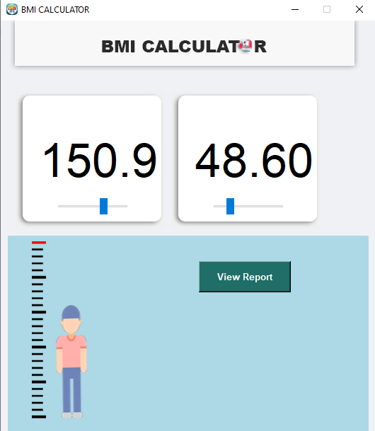
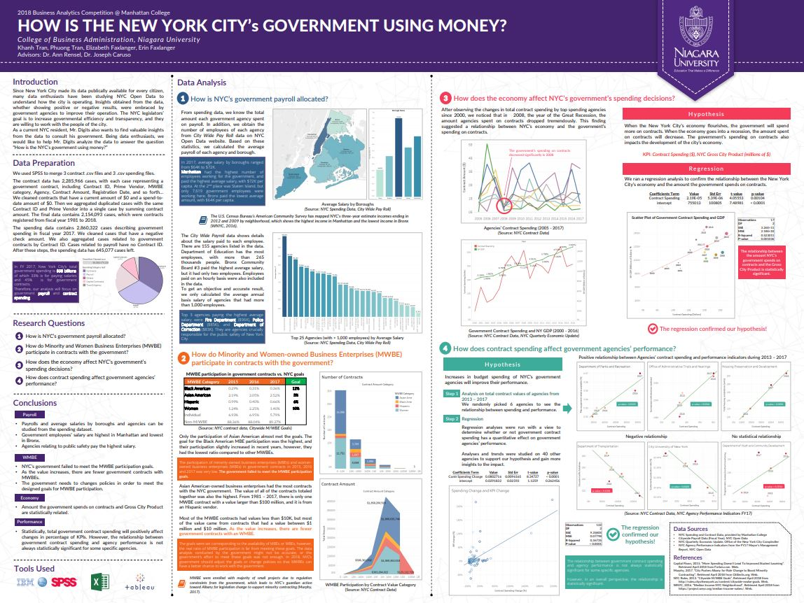

# Portfolio
---
## Python

<!-- ### Python Weather App with Real-time Data and GUI

My complete implementation of assignments and projects in [***CS224n: Natural Language Processing with Deep Learning***](http://web.stanford.edu/class/cs224n/) by Stanford (Winter, 2019).

**Neural Machine Translation:** An NMT system which translates texts from Spanish to English using a Bidirectional LSTM encoder for the source sentence and a Unidirectional LSTM Decoder with multiplicative attention for the target sentence ([GitHub](https://github.com/HuuKienIT/CS224n-NLP-Solutions/tree/master/assignments/)).

**Dependency Parsing:** A Neural Transition-Based Dependency Parsing system with one-layer MLP ([GitHub](https://github.com/HuuKienIT/CS224n-NLP-Assignments/tree/master/assignments/a3)).

--- -->
<!-- ### Python BMI Calculator with Graphical User Interface (GUI)

<!--  

The release of Google's BERT is described as the beginning of a new era in NLP. In this notebook I'll use the HuggingFace's transformers library to fine-tune pretrained BERT model for a classification task. Then I will compare BERT's performance with a baseline model, in which I use a TF-IDF vectorizer and a Naive Bayes classifier. The transformers library helps us quickly and efficiently fine-tune the state-of-the-art BERT model and yield an accuracy rate 10% higher than the baseline model.

--- -->
###  Python Weather App with Real-time Data and GUI

<!--  -->

This Python weather application is developed to provide users with real-time weather information in a visual and easy-to-use way. The application uses Python and open-source libraries to access weather API data, process data, and display information on a graphical user interface (GUI).

 

 

---
###  Python BMI Calculator with Graphical User Interface (GUI)

<!--  -->

This Python BMI calculator is developed to provide users with an easy and intuitive way to calculate their Body Mass Index (BMI). The application uses Python and open-source libraries to create a graphical user interface (GUI) and perform BMI calculations.

 

 

---
## Web development
###  E-commerce Platform for Sneakers (Front-end- Back-end Development)

<!--  -->

This project is about developing a comprehensive e-commerce platform that allows users to buy sneakers. The platform will include both a front-end and back-end developed using modern and scalable technologies.

 
<!-- 

 -->
 

---
## Java Application
###  Java Application for Inventory Management and Sales in Watch Store

<!--  -->

This project aims to develop a Java application for efficient inventory management and sales management in a watch store. The application will provide a user-friendly interface for store personnel to manage watch stock, process sales transactions, and generate reports.

 
<!-- 

 -->
 

---
###  Library Management System using Console

<!-- 
 -->

This project aims to develop a user-friendly console-based application to manage a library's book collection and user borrowing activities. The application will provide a menu-driven interface for librarians and users to interact with the library system efficiently.

 
<!-- 

 -->
 

---
<!-- ### Kaggle Competition: Predict Ames House Price using Lasso, Ridge, XGBoost and LightGBM

I performed comprehensive EDA to understand important variables, handled missing values, outliers, performed feature engineering, and ensembled machine learning models to predict house prices. My best model had Mean Absolute Error (MAE) of 12293.919, ranking <b>95/15502</b>, approximately <b>top 0.6%</b> in the Kaggle leaderboard.

 

 

---
### Predict Breast Cancer with RF, PCA and SVM using Python

In this project I am going to perform comprehensive EDA on the breast cancer dataset, then transform the data using Principal Components Analysis (PCA) and use Support Vector Machine (SVM) model to predict whether a patient has breast cancer.

 

 

---
### Business Analytics Conference 2018: How is NYC's Government Using Money?

In three-month research and a two-day hackathon, I led a team of four students to discover insights from 6 million records of NYC and Boston government spending data sets and won runner-up prize for the best research poster out of 18 participating colleges.

 

 

--- -->
<!-- ## Filmed by me

Besides Data Science, I also have a great passion for photography and videography. Below is a list of films I documented to retain beautiful memories of places I traveled to and amazing people I met on the way.

 

- [Ada Von Weiss - You Regret (Winter at Niagara)](https://www.youtube.com/watch?v=-5esqvmPnHI)
- [The Weight We Carry is Love - TORONTO](https://www.youtube.com/watch?v=vfZwdEWgUPE)
- [In America - Boston 2017](https://www.youtube.com/watch?v=YdXufiebgyc)
- [In America - We Call This Place Our Home (Massachusetts)](https://www.youtube.com/watch?v=jzfcM_iO0FU)

--- -->

© 2023 Huu Kien.

